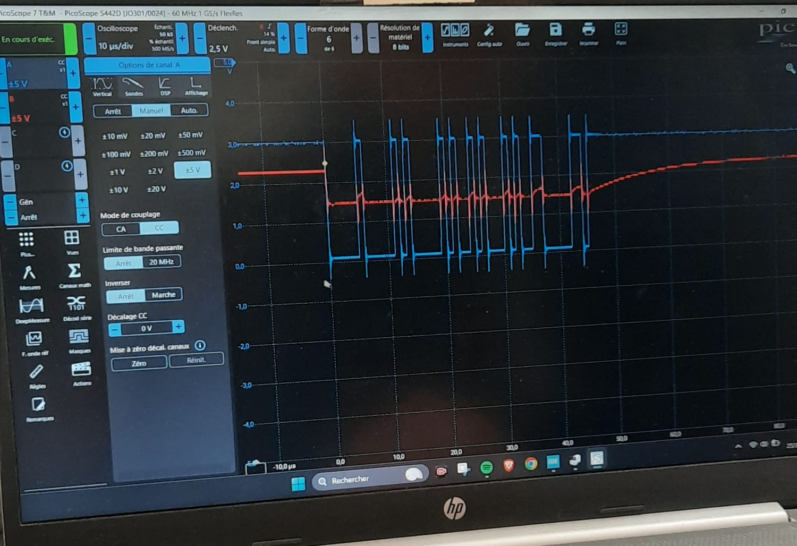
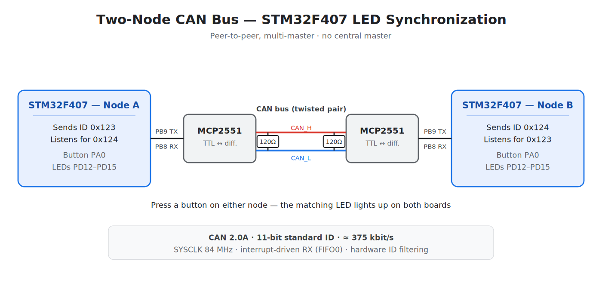

# CAN Bus Multi-Node Network — LED Synchronization on Two STM32F407

Two STM32F407 boards talking to each other over a real CAN 2.0 bus. Press the button on one board, and the matching LED lights up on **both** — in real time, through the same wire pair that runs through every modern car.

This started as a supervised project at **ENSIT** (École Nationale Supérieure d'Ingénieurs de Tunis, Génie Électrique, 2024/2025) on interconnected multiprocessor systems. The idea was simple but the goal was real: build the smallest possible distributed system that genuinely communicates, validate it in simulation, then run it on hardware — and lay the groundwork for scaling it to more nodes later.

*(Bilingual — English first, [version française plus bas](#-version-française).)*

---

## See it in action



*A real CAN frame captured on a PicoScope while the two nodes exchange data — the digital line carrying the bits on one channel, the bus signal on the other.*

https://github.com/user-attachments/assets/a27d840a-53e0-40ce-9ab5-3bfce181a764

---

## What it does

Each board runs the same firmware and behaves as a peer — there's no master. On a button press, a node cycles its LED index (1 → 2 → 3 → 4 → 1…), lights its own LED, and broadcasts the new value on the bus. The other node receives that frame through a hardware interrupt and mirrors the LED locally. The two boards stay in lockstep, and because CAN is multi-master, either one can drive the exchange.

It's a small system, but it touches the whole CAN cycle: transmit, hardware filtering, interrupt-driven receive, and bus arbitration when both nodes want to talk at once.

---

## Hardware

- **2× STM32F407VG-DISC1** — ARM Cortex-M4, 1 MB Flash, 192 KB RAM
- **2× MCP2551** CAN transceivers (ISO 11898, up to 1 Mb/s) — the STM32 has the CAN controller built in, but needs a transceiver to drive the physical differential bus
- **CAN bus** — twisted CAN_H / CAN_L pair with a **120 Ω termination resistor at each end** to kill reflections
- On-board **user button (PA0)** and **LEDs (PD12–PD15)**

---

## Wiring

For each STM32 → MCP2551:

| STM32 | → | MCP2551 |
|-------|---|---------|
| PB9 (CAN1_TX) | → | TXD |
| PB8 (CAN1_RX) | → | RXD |
| 5V | → | VDD |
| GND | → | VSS |

Then bridge the two transceivers: `CANH ↔ CANH`, `CANL ↔ CANL`, with the 120 Ω resistor across CANH/CANL at both ends.



---

## CAN configuration

| Parameter | Value |
|-----------|-------|
| Peripheral | CAN1 (PB8 RX / PB9 TX, AF9) |
| Mode | Normal |
| Auto-retransmission | Disabled |
| Clock source | HSE 8 MHz → PLL (M=4, N=84, P=2) → SYSCLK 84 MHz |
| CAN clock (APB1) | 42 MHz |
| Prescaler | 16 |
| Sync Jump Width | 1 TQ |
| Time Segment 1 | 4 TQ |
| Time Segment 2 | 2 TQ |
| Nominal bit rate | ≈ 375 kbit/s |
| Frame format | CAN 2.0A — standard 11-bit ID |
| Receive path | Interrupt (CAN1_RX0, FIFO0 message pending) |

The bit timing matters more than it looks: every node on the bus has to agree on the bitrate and a compatible sample point, or arbitration falls apart. SJW exists precisely to absorb the small clock drift between boards during resynchronization.

Reception goes through a single-bank **hardware ID-mask filter** routing frames to FIFO0, so the CPU is only interrupted for traffic that matters — no polling the bus in a loop. Each node transmits under its own `OwnID` (0x123) and reacts to its peer's `RemoteID` (0x124).

---

## How the code is organized

**Transmit — on button press:**
```c
if (HAL_GPIO_ReadPin(GPIOA, GPIO_PIN_0) == GPIO_PIN_SET) {
    if (myLEDVar == 4) myLEDVar = 0;
    LED_Switch(++myLEDVar);          // update the local LED

    TxData[0] = myLEDVar;            // payload carries the LED index
    HAL_CAN_AddTxMessage(&hcan1, &TxHeader, TxData, &TxMailbox);
    HAL_Delay(200);                  // simple debounce
}
```

**Receive — interrupt callback, fires automatically:**
```c
void HAL_CAN_RxFifo0MsgPendingCallback(CAN_HandleTypeDef *hcan) {
    if (HAL_CAN_GetRxMessage(hcan, CAN_RX_FIFO0, &RxHeader, RxData) == HAL_OK) {
        if (RxHeader.StdId == RemoteID) {
            myLEDVar = RxData[0];
            LED_Switch(myLEDVar);    // mirror the peer's LED
        }
    }
}
```

Each node has its own `OwnID` and listens for the peer's `RemoteID`, so the two boards never confuse their own traffic with the other's.

---

## A note on arbitration

What makes CAN multi-master work is non-destructive bitwise arbitration. If both nodes start transmitting at the same time, they send their ID bit by bit while listening to the bus. A dominant bit (0) always wins over a recessive one (1). The moment a node sends a recessive bit but reads back a dominant one, it knows it lost, backs off, and becomes a receiver — without corrupting the frame that won. The lowest ID always gets through first, and it never has to retransmit. No central referee, no collisions thrown away.

---

## Build, flash, run

1. Open `CAN_LED_synchronization.ioc` in STM32CubeMX / STM32CubeIDE (or import the project)
2. Build in Debug configuration
3. Flash each board over ST-LINK
4. Give each node a distinct identity — swap `OwnID` / `RemoteID` on the second board
5. Wire the two transceivers together with 120 Ω termination at each end
6. Press a button — both LEDs should follow

The behaviour was first validated in **Proteus** before going to real hardware, which made it easy to catch wiring and timing mistakes early.

---

## What I'd build next

The whole point of starting with two nodes was to keep the door open for more. The natural next steps: add a third and fourth board, give each a real role (sensor / actuator / logger) instead of just mirroring LEDs, and use the ID priority scheme to handle genuinely competing traffic.

---

## Tech stack

`STM32F407` · `CAN 2.0A` · `MCP2551` · `STM32 HAL` · `Interrupt-driven RX` · `Hardware ID filtering` · `STM32CubeIDE` · `Proteus`

---
---

<a name="-version-française"></a>
## 🇫🇷 Version française

# Réseau multi-nœuds sur bus CAN — Synchronisation de LEDs entre deux STM32F407

Deux cartes STM32F407 qui se parlent sur un vrai bus CAN 2.0. On appuie sur le bouton d'une carte, et la LED correspondante s'allume sur **les deux** — en temps réel, via la même paire de fils qu'on retrouve dans toutes les voitures modernes.

Ce projet est né d'un projet encadré à l'**ENSIT** (École Nationale Supérieure d'Ingénieurs de Tunis, Génie Électrique, 2024/2025) sur les systèmes multiprocesseurs interconnectés. L'idée était simple mais l'objectif concret : construire le plus petit système distribué qui communique vraiment, le valider en simulation, le faire tourner sur matériel — et poser les bases pour l'étendre à davantage de nœuds par la suite.

---

### À voir en action


*Une vraie trame CAN capturée au PicoScope pendant que les deux nœuds échangent des données — la ligne numérique portant les bits sur une voie, le signal du bus sur l'autre.*

https://github.com/user-attachments/assets/a27d840a-53e0-40ce-9ab5-3bfce181a764

---

### Ce que ça fait

Chaque carte exécute le même firmware et se comporte en pair — il n'y a pas de maître. À chaque appui bouton, un nœud fait défiler son index de LED (1 → 2 → 3 → 4 → 1…), allume sa propre LED, et diffuse la nouvelle valeur sur le bus. L'autre nœud reçoit cette trame par interruption matérielle et reflète la LED localement. Les deux cartes restent synchronisées, et comme le CAN est multi-maître, n'importe laquelle peut initier l'échange.

C'est un petit système, mais il couvre tout le cycle CAN : émission, filtrage matériel, réception sur interruption, et arbitrage du bus quand les deux nœuds veulent parler en même temps.

---

### Matériel

- **2× STM32F407VG-DISC1** — ARM Cortex-M4, 1 Mo de Flash, 192 Ko de RAM
- **2× transceivers CAN MCP2551** (ISO 11898, jusqu'à 1 Mb/s) — le STM32 intègre le contrôleur CAN, mais a besoin d'un transceiver pour attaquer le bus différentiel physique
- **Bus CAN** — paire torsadée CAN_H / CAN_L avec une **résistance de terminaison de 120 Ω à chaque extrémité** pour supprimer les réflexions
- **Bouton utilisateur (PA0)** et **LEDs (PD12–PD15)** intégrés

---

### Câblage

Pour chaque STM32 → MCP2551 :

| STM32 | → | MCP2551 |
|-------|---|---------|
| PB9 (CAN1_TX) | → | TXD |
| PB8 (CAN1_RX) | → | RXD |
| 5V | → | VDD |
| GND | → | VSS |

Puis on relie les deux transceivers : `CANH ↔ CANH`, `CANL ↔ CANL`, avec la résistance de 120 Ω entre CANH/CANL aux deux extrémités.


---

### Configuration CAN

| Paramètre | Valeur |
|-----------|--------|
| Périphérique | CAN1 (PB8 RX / PB9 TX, AF9) |
| Mode | Normal |
| Retransmission auto | Désactivée |
| Source d'horloge | HSE 8 MHz → PLL (M=4, N=84, P=2) → SYSCLK 84 MHz |
| Horloge CAN (APB1) | 42 MHz |
| Prescaler | 16 |
| Sync Jump Width | 1 TQ |
| Time Segment 1 | 4 TQ |
| Time Segment 2 | 2 TQ |
| Débit nominal | ≈ 375 kbit/s |
| Format de trame | CAN 2.0A — identifiant standard 11 bits |
| Réception | Interruption (CAN1_RX0, message en attente sur FIFO0) |

Le bit timing compte plus qu'il n'y paraît : tous les nœuds du bus doivent s'accorder sur le débit et un sample point compatible, sinon l'arbitrage ne fonctionne plus. Le SJW existe justement pour absorber les petites dérives d'horloge entre les cartes lors de la resynchronisation.

La réception passe par un **filtre matériel mono-banc en mode masque d'identifiant** qui route les trames vers FIFO0 : le CPU n'est interrompu que pour le trafic pertinent — pas d'interrogation du bus en boucle. Chaque nœud émet sous son propre `OwnID` (0x123) et réagit au `RemoteID` (0x124) de son pair.

---

### Organisation du code

**Émission — sur appui bouton :**
```c
if (HAL_GPIO_ReadPin(GPIOA, GPIO_PIN_0) == GPIO_PIN_SET) {
    if (myLEDVar == 4) myLEDVar = 0;
    LED_Switch(++myLEDVar);          // met à jour la LED locale

    TxData[0] = myLEDVar;            // la charge utile porte l'index de LED
    HAL_CAN_AddTxMessage(&hcan1, &TxHeader, TxData, &TxMailbox);
    HAL_Delay(200);                  // anti-rebond simple
}
```

**Réception — callback d'interruption, déclenché automatiquement :**
```c
void HAL_CAN_RxFifo0MsgPendingCallback(CAN_HandleTypeDef *hcan) {
    if (HAL_CAN_GetRxMessage(hcan, CAN_RX_FIFO0, &RxHeader, RxData) == HAL_OK) {
        if (RxHeader.StdId == RemoteID) {
            myLEDVar = RxData[0];
            LED_Switch(myLEDVar);    // reflète la LED du nœud distant
        }
    }
}
```

Chaque nœud a son propre `OwnID` et écoute le `RemoteID` du pair, de sorte que les deux cartes ne confondent jamais leur propre trafic avec celui de l'autre.

---

### Un mot sur l'arbitrage

Ce qui fait fonctionner le multi-maître du CAN, c'est l'arbitrage bit à bit non destructif. Si les deux nœuds commencent à émettre en même temps, ils envoient leur identifiant bit par bit tout en écoutant le bus. Un bit dominant (0) l'emporte toujours sur un bit récessif (1). Dès qu'un nœud envoie un bit récessif mais relit un bit dominant, il sait qu'il a perdu, se retire et devient récepteur — sans corrompre la trame gagnante. L'identifiant le plus faible passe toujours en premier, et n'a jamais à retransmettre. Pas d'arbitre central, aucune collision gâchée.

---

### Compilation, flash, exécution

1. Ouvrir `CAN_LED_synchronization.ioc` dans STM32CubeMX / STM32CubeIDE (ou importer le projet)
2. Compiler en configuration Debug
3. Flasher chaque carte via ST-LINK
4. Donner une identité distincte à chaque nœud — intervertir `OwnID` / `RemoteID` sur la seconde carte
5. Relier les deux transceivers avec terminaison 120 Ω à chaque extrémité
6. Appuyer sur un bouton — les deux LEDs doivent suivre

Le comportement a d'abord été validé sous **Proteus** avant le passage sur matériel réel, ce qui a permis de repérer tôt les erreurs de câblage et de timing.

---

### Et après

Tout l'intérêt de démarrer à deux nœuds était de garder la porte ouverte. Les prochaines étapes naturelles : ajouter une troisième et une quatrième carte, donner à chacune un rôle réel (capteur / actionneur / enregistreur) plutôt qu'un simple miroir de LEDs, et exploiter le schéma de priorité par identifiant pour gérer un trafic réellement concurrent.

---

### Stack technique

`STM32F407` · `CAN 2.0A` · `MCP2551` · `HAL STM32` · `Réception sur interruption` · `Filtrage matériel par ID` · `STM32CubeIDE` · `Proteus`
